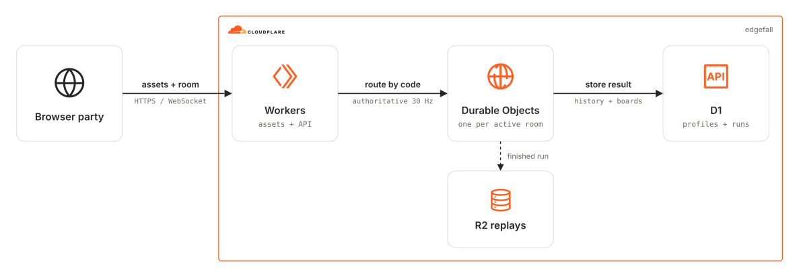

# Edgefall

Edgefall is a one-to-four-player online run-and-gun roguelite vertical slice set in the diesel-fantasy Cinder Railworks.

Private crews cross hand-authored foundry modules, fight on a moving freight lift, survive the collapsing Fall, and break the three-phase Kilnheart Engine in an authoritative 30 Hz room.

Daily crews receive separate private rooms with the same fixed date seed, so their runs remain comparable without sharing live combat state.

## Architecture Diagram

<picture>
  <source media="(prefers-color-scheme: dark)" srcset="./src/assets/arch-diagram-dark.svg">
  
</picture>

The deterministic TypeScript simulation in `src/game/` is shared by the browser and Durable Object.

Phaser is presentation-only: it renders at a 640×360 logical resolution, predicts the local player's movement, reconciles acknowledged inputs, and interpolates remote snapshots.

The Worker serves static assets and profile, leaderboard, result, and room routes; one hibernatable Durable Object owns each active room; D1 stores anonymous profiles and run records; R2 stores compact completed-run replay streams.

CDKTN owns the D1 and R2 backing resources.

Wrangler exclusively owns Worker code, the Durable Object migration, bindings, and static-asset deployment.

## Prerequisites

- Cloudflare API access with `Workers Scripts:Edit`, `D1:Edit`, `Workers R2 Storage:Edit`, and `Account Settings:Read` permissions.
- [mise](https://mise.jdx.dev/installing-mise.html), which installs the repository's Node, pnpm, OpenTofu, and CDKTN versions.

## Installation

```sh
mise install
pnpm install
pnpm gen
cp .dev.vars.example .dev.vars
```

Set a local `PROFILE_COOKIE_SECRET` of at least 32 random characters in `.dev.vars`.

`pnpm gen` generates the Cloudflare provider constructs into `.gen/`; rerun it when the provider constraint in `cdktf.json` changes.

## Local play

```sh
pnpm dev
```

Open `http://localhost:8787`.

Wrangler supplies local Durable Object, D1, R2, and static-asset implementations, so local play does not require a Cloudflare account.

### Controls

- Run: `A` / `D` or left stick.
- Jump: `Space` or gamepad south; hold `S` and jump to drop through a platform.
- Aim and fire: pointer and primary mouse button, or right stick and right trigger.
- Reload: `R` or right bumper.
- Dodge: `Shift` or gamepad east.
- Melee and revive: `F` or gamepad west.
- Ordnance: `Q` or left bumper.
- Operative ability: `E` or gamepad north.

Friendly fire is disabled, upgrade choices are personal, and destructible supplies are shared automatically.

Downed operatives can crawl and use a sidearm, allies revive with melee, and an eliminated operative re-enters after a short delay.

### Redesign controller laboratory

Run `pnpm dev:lab` and open `http://localhost:8787/controller-lab.html` for the new 60 Hz controller's isolated engineering surface. Select the obstacle course, moving support, crush, grounded enemy ledge authored jump/drop link or chained-route fixture; run or single-step, inspect contacts, and export/import a bounded deterministic input recording. This lab uses temporary geometry visuals and does not connect to a multiplayer room. The ordinary client build excludes development laboratories.

Open `http://localhost:8787/art-review.html` in the same lab build to inspect the W06 concept sources and native operative candidate. The native section provides four palettes, individual drawings, recoil/throw/knife and full-body life clips, fixed roots/contacts and hand/grip markers, background comparisons and normal/quarter-speed playback. Enable “Native operative candidate” in the combat inspector to exercise sidearm movement, throws, contextual knife attacks and authoritative death/reentry. `pnpm art:export` rebuilds the static atlas from editable indexed pixels; `pnpm art:validate` checks source integrity and exact export identity. `pnpm test:art:review` and `pnpm test:art:native` verify the review controls and actual browser rendering. Concept images remain outside the gameplay asset set.

`pnpm test:lab:controller` builds the labs and verifies keyboard input, replay and rendering in local Chromium. Set `EDGEFALL_CHROMIUM_PATH` to an installed Chromium executable when it is not in Playwright's default location. See the [controller lab evidence](./docs/redesign-evidence/W03-controller-lab.md) for exact coverage and remaining acceptance work.

Open `http://localhost:8787/combat-lab.html` for the shared firearm timeline, authored muzzle/hurtbox inspector and swept projectile path. The range, thin-wall and frontal-shield scenarios support one to four deterministic input slots, sidearm/HMG cadence and ammo, physical target motion, exact kill credit, single stepping and recording replay. `pnpm test:lab:combat` verifies its browser controls and replay. These are engineering fixtures; production combat and final media remain in progress.

`pnpm test:network:controller --combat` owns a local workerd room and four Chromium contexts to verify authoritative firearm/projectile snapshots, enemy removal and shared world hashes. `--combat-fault` instead rejects a prepared world tick and verifies that no world state, committed event or input acknowledgment advances. The regular command and `--recovery` retain the movement/lease and controller-session checks. See the earlier [world transaction evidence](./docs/redesign-evidence/W04-world-transaction.md) for the commit boundary and initial snapshot proof.

`pnpm test:network:controller --events` verifies the [acknowledged gameplay-event stream](./docs/events-v3.md), including dropped-frame replay, duplicate suppression, ring expiry and explicit full-baseline repair for individual readers. See the [event delivery evidence](./docs/redesign-evidence/W04-events.md). Confirmed engineering hit/shot markers use event identities; predicted effects, final audio and complete combat recovery remain in progress.

`pnpm test:network:controller --combat-reconnect` verifies signed profile ownership, individual socket takeover/reentry, fresh snapshot acknowledgment, healthy player continuity and SQLite recovery after reconnection. The loopback laboratory preserves the reserved player's weapon, active action and lives; its browser initializes the renderer before requesting a moving-world baseline. `--combat-recovery` retains the separate full-cohort process/write-failure recovery proof. See the [per-player reconnect evidence](./docs/redesign-evidence/W04-combat-reconnect.md) for scope and remaining production work.

`pnpm test:network:controller --combat-auto-reconnect` verifies automatic recovery after a peer disconnect, browser stall and Worker restart, plus profile loss and tab takeover. The laboratory now persists the exact empty-room tick, restores it on a reserved player's ordinary reconnect, and permits one ready player to restart while other slots remain reserved. It also waits for a real ninety-second reservation expiry alarm and verifies the terminal state across another process restart. Fresh input and start remain explicit. See the [empty-room recovery evidence](./docs/redesign-evidence/W04-empty-room.md) and earlier [production v2 reconnect evidence](./docs/redesign-evidence/W04-automatic-reconnect.md).

`pnpm test:network:controller --combat-loading` verifies connected-tab replacement and reserved-player reentry while loading. It persists a fresh connection generation without advancing combat, discards the replaced player's queued input, preserves the other players' preload and requires a fresh baseline before start. The scenario then exercises playing reconnect and durable process recovery. See the [loading connection evidence](./docs/redesign-evidence/W04-loading-connections.md).

`pnpm test:network:controller --combat-phases` adds the real lobby, signed host load/start commands, stale-epoch rejection, host succession and same-document recovery of an empty lobby before the loading/playing regressions. The [format 12 combat archive](./docs/combat-checkpoint-v12.md) preserves the phase where an empty room paused. Mission intermission and completed-result storage still use seeded fixtures. See the [room phase evidence](./docs/redesign-evidence/W04-room-phases.md).

`pnpm test:network:controller --combat-campaign` drives four browsers through actual falls and a full-party wipe, delays final persistence, then verifies a signed host continue and fresh input after automatic reconnection. The checkpoint spends one credit and rebuilds enemies with fresh IDs in the same SQLite transaction. Life transitions reconcile without replacing the player connection, and pre-pause packets drain without applying gameplay. See the [continue evidence](./docs/redesign-evidence/W04-continues.md). Authored mission progression, results/outbox, rematch and production v3 remain in progress.

`pnpm test:network:controller --combat-hostile` selects the attacking rifle fixture. Four keyboard clients crouch through a committed burst, take hostile damage, return fire and compare snapshot/event histories. Riflemen raise before three finite releases, retain aim through the burst and cancel later markers on death; active bursts and spent player lives survive checkpoint recovery. Protocol 3.11 distinguishes enemy events from player shot confirmations. See the [rifle evidence](./docs/redesign-evidence/W05-riflemen.md). These are engineering visuals; full vehicle coverage, authored missions and final assets remain in progress.

`pnpm test:network:controller --combat-melee`and `--combat-grenade` run separate fresh four-browser rooms with real keyboard intent and duplicate event delivery. Knife attacks use an authored active window and per-target hit history; standing/crouched grenades debit once, release at the hand, bounce at most three times and detonate after a 90-tick fuse with cover-aware radius damage. Both actions preserve their private state through checkpoints and committed-input replay. See the [foot combat evidence](./docs/redesign-evidence/W05-foot-combat.md).

`pnpm test:network:controller --combat-guard` runs a fresh mixed shield/rifle encounter with four keyboard clients. Shield infantry brace, advance, commit a turn, telegraph a finite bash and retain separate break/stun state. Jumping, exposed flanks and explosive shield damage provide counterplay while ordinary body hits remain lethal. Protocol 3.11 and archive 12 preserve presentation and private continuation; local combat recordings use format 9. See the [shield evidence](./docs/redesign-evidence/W05-shield-infantry.md). The [W05 audit](./docs/redesign-evidence/W05-acceptance-audit.md) identifies the remaining behavior and acceptance work.

`pnpm test:network:controller --combat-shotgun` and `--combat-flame` run separate four-browser weapon fixtures. Shotgun uses one expanding 110-pixel blast per shell. Flame emits three attached/traveling lobes per charge with a shared per-target cooldown. Both views draw exact clipped rectangles from the authoritative snapshot, and checkpoint recovery retains their emission and hit histories. See the [area weapon evidence](./docs/redesign-evidence/W05-area-weapons.md). These fixtures supply representative W05 behavior; full W07 balance, final media and the broader moving-terrain matrix remain open.

## Production deployment

Deploy the backing resources and Worker:

```sh
pnpm run deploy
```

Immediately after the first deploy, add the Worker secret with the generated production configuration:

```sh
pnpm exec wrangler secret put PROFILE_COOKIE_SECRET --config .wrangler.deploy.json
```

Later deploys preserve the secret.

The deploy command builds and validates the client, provisions D1 and R2 with CDKTN, writes their outputs to the ignored Wrangler configuration, applies D1 migrations, and deploys Worker code, the Durable Object migration, and static assets with Wrangler.

The [vertical-slice migration note](./docs/migration-notes.md) records the intentional pre-1.0 reset of incompatible prototype leaderboard rows.

Destroying the CDKTN stack removes only its backing resources:

```sh
pnpm destroy
```

Remove the Wrangler-owned Worker separately when a complete teardown is intended.

## Content and evidence

The current slice contains Rook and Vale with two outfits, four primary weapons, two ordnance choices, weapon mutations, relics, five standard enemy roles, the Slag Warden elite, destructibles, the freight-lift fight, the Fall, and the Kilnheart Engine.

The [legacy style benchmark](./docs/style-benchmark.md) records the existing product's asset prompts. The redesign's [W06 source review](./docs/redesign-evidence/style-v2/README.md) begins the replacement benchmark and retains the required human art/audio gate.

The existing Rook, enemy, weapon, VFX and environment assets remain in the v2 product. The redesign now has 75 native operative drawings with independent locomotion, authored head/jacket motion, sidearm recoil, knife/throw clips, hand/grip contracts and full-body death/reentry in the local inspector. The two generated concept sheets retain their recorded defects. Vertical-aim craft, vehicle acting, remaining weapon/enemy/scenery/audio production and the complete benchmark still require work and human review.

Every runtime media file is original or redistribution-compatible licensed and recorded in the checked-in [asset provenance manifest](./public/assets/manifest.json).

The 12–18 minute duration, stable 60 FPS target, boss readability, and four-player enjoyment remain playtest acceptance criteria; automated checks do not claim those human and hardware results.

## Validation

```sh
pnpm check
pnpm types
```

`pnpm check` runs Biome, asset integrity and licence validation, all three TypeScript configurations, the deterministic simulation and network tests, the Worker/client dry-run bundle, and CDKTN synthesis.

`pnpm types` refreshes `worker-configuration.d.ts` after a binding change.

`pnpm test:network:controller --combat-tank` exercises four real keyboard clients boarding, jumping, aiming the turret, driving, defeating rifle infantry and exiting. The local combat inspector also offers the tank scenario, with E for entry/exit. Protocol 3.11 carries hull and turret state with separate vehicle and player ownership generations; archive 12 preserves seat transfers, gun cadence, armor windows and bounded disconnect release. Tank movement currently uses authoritative snapshots. The primary gun is unlimited; the cannon, sacrifice action, final media and the broader W08 vehicle matrix remain open. See the [tank evidence](./docs/redesign-evidence/W05-tank.md).

`pnpm test:network:controller --combat-ordnance` throws grenades from a moving lift into a closing press with four keyboard clients. Launches inherit bounded player/platform velocity; settled grenades ride supports, rebounds detach, and a proved crush removes the grenade with a harmless terrain impact. The `ordnance` inspector scenario supports single-step recording and exact replay around those boundaries. See the [grenade platform evidence](./docs/redesign-evidence/W05-ordnance.md).

The `hmg` inspector scenario adds nine authored infantry HMG directions. The barrel advances one heading every two ticks while fire retains its five-tick cadence; each heading uses matching sockets and integer projectile velocity. Portable replay, SQLite recovery, the keyboard inspector and the `pnpm test:network:controller --combat-hmg` four-browser gate pass. The client bounds sends to its last validated snapshot and retains later inputs, correcting the earlier missing transport limit; see the [input flow evidence](./docs/redesign-evidence/W04-input-flow.md) and [HMG evidence](./docs/redesign-evidence/W05-hmg-sweep.md). Protocol 3.11 carries independent barrel continuation in 304-byte player records; archive 12 and recording format 9 reject the prior experimental layouts. Host-clock and impairment findings remain open, and final drawings, sound and feel still need the W06 benchmark review.

`pnpm test:network:controller --combat-support` exercises an authored destructible scaffold. Two short fire taps per player break its support; the grounded rifle/shield enemies then fall through a real gap and resolve the encounter without invented kill credit. The `support` inspector scenario exposes damage, geometry changes and exact recording replay. Protocol 3.11, archive 12 and recording format 9 retain the prop and its destruction ownership. See the [support evidence](./docs/redesign-evidence/W05-support.md).

Player corpses now retain airborne momentum, use shared gravity and swept collision, settle on floors and one-way platforms, and follow moving supports. Void or unresolved crush/contact recovery removes the body without spending another life; the original death/respawn deadlines remain authoritative. Protocol 3.11 and [archive 12](docs/combat-checkpoint-v12.md) retain corpse presence across snapshots and recovery. The [death-body evidence](docs/redesign-evidence/W03-death-body.md) covers local physics, real hostile hits, native presentation and storage; it does not close the W06 human style or deployed timing gates.

Protected entry now follows moving support and shared collision. Unsafe initial anchors are skipped; a crush or void during the twelve-tick entry phase hides the body and retries without spending a life. Fresh jump/fire becomes available on the first control tick. A living player crushed by the authored press loses one life and reenters normally. See the [entry physics evidence](docs/redesign-evidence/W03-player-entry.md) and [archive 12 contract](docs/combat-checkpoint-v12.md).
