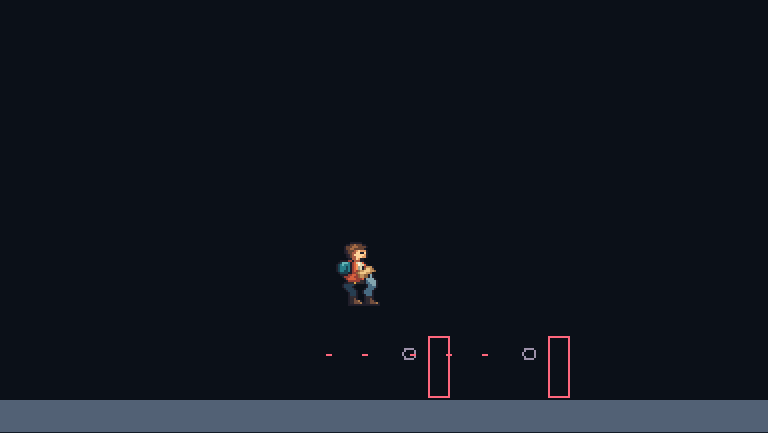
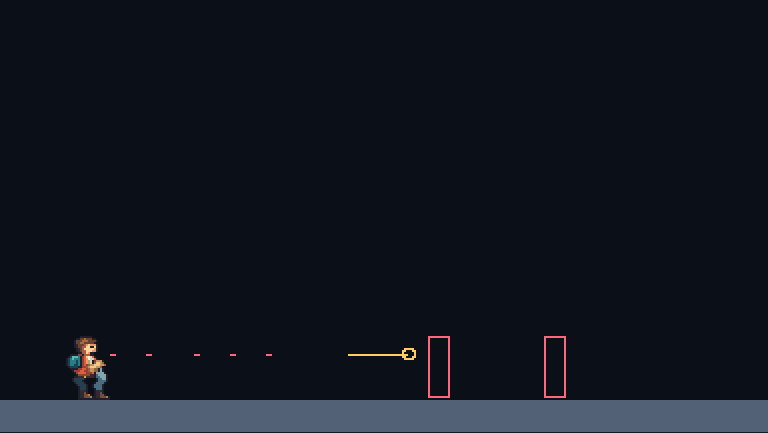

# Authoritative airborne player death

An airborne player previously stopped moving after a lethal hit: damage cleared velocity and the foot controller returned inactive for non-alive actors. The shared life owner now preserves accepted airborne momentum and advances present corpses through gravity, swept collision and moving support carry. Ground contact stops horizontal motion. A fall into the void or unresolved crush/contact recovery removes the body without another life debit or a changed life clock.

The explicit `deathBody` state survives public snapshots, private checkpoints and committed input replay. A blocked entry waits while a present corpse continues moving or a removed corpse stays inert. Safe entry and spectating retire the corpse on the existing deadlines. [Archive 11 and lifecycle contract](../combat-checkpoint-v11.md).

| Gate                | Result and scope                                                                                                                                                                                                                                                | Evidence                                                                                                                                                                                                                            |
| ------------------- | --------------------------------------------------------------------------------------------------------------------------------------------------------------------------------------------------------------------------------------------------------------- | ----------------------------------------------------------------------------------------------------------------------------------------------------------------------------------------------------------------------------------- |
| Required checks     | 601 tests across 61 files; asset/content checks, all TypeScript targets, production client/Worker dry run and CDK Terrain synthesis                                                                                                                             | [Check log](death-body/check.log.gz)                                                                                                                                                                                                |
| Passive physics     | Solid/one-way landing, moving support carry and loss, crush retirement, bounded void waiting and entry retry; separate wall/ceiling and invalid-state tests                                                                                                     | [Cross-runtime report](death-body/contracts.json.gz)                                                                                                                                                                                |
| Actual hostile hits | Four admitted controllers with duplicate packets: rising kill at tick 37, falling kill at 77 and landing at 81; twelve checkpoint/journal boundaries preserve full state, with 580 duplicate packets per case                                                   | [Cross-runtime report](death-body/contracts.json.gz)                                                                                                                                                                                |
| SQLite recovery     | Four cold process boundaries across rising/falling kills; injected rollback before each segment commit; restored death/entry clocks and exactly one spent life. The existing real-fall fixture also preserves removed presence across cold death/entry recovery | [Storage report](death-body/storage.json.gz)                                                                                                                                                                                        |
| Native inspector    | Real keyboard jumps and enemy kills, authoritative roots, exact unobscured sprite pixels, floor settling, void hiding and thirteen exact UI recording imports                                                                                                   | [Browser report](death-body/native.json.gz), [rising recording](death-body/death-rising-recording.json), [falling recording](death-body/death-falling-recording.json), [removed recording](death-body/death-removed-recording.json) |
| Network regression  | Four Chromium keyboard clients over local workerd WebSockets retain hostile damage, crouch evasion, reconciliation and return-fire credit under the new wire version                                                                                            | [Network report](death-body/network.json.gz)                                                                                                                                                                                        |

Node, Chromium and local workerd compare the complete conformance result, including death-body cases and portable archive replay. The single-player native inspector kills the rising player at tick 39; the four-controller archive fixture kills slot 3 at tick 37. These are different admitted scenarios. The falling case lands four ticks after death. A still-rising corpse may be replaced by a safe entry before reaching the floor because the existing thirty-tick death deadline takes priority.

Native presentation holds an early death drawing while airborne, samples the existing grounded sequence on support and hides removed bodies. Pixel comparisons start after the killing tick because its white diagnostic impact circle intentionally overlays the sprite. The existing 75-drawing source and its twenty clips are unchanged. Dedicated airborne acting, landing/recovery craft, moving-support behavior during the twelve-tick protected entry phase, accessible-rule hurt response and vehicle transfer acting remain follow-up work. These engineering captures are not human style acceptance or the complete four-player/audio benchmark.

Protocol **3.10**, archive **11** and simulation/recording **8** reject prior experimental versions. Player records are 304 bytes; a four-player snapshot gains sixteen bytes. These are format bounds, not performance measurements. Historical native-action recordings use format 7 and require the documented `331d535` checkout. The [artifact manifest](death-body/artifacts.json) identifies current source and report bytes; report commit fields name the pre-change base.

Source and generated Wrangler configurations both retain explicit traces and invocation logs at sampling 1, plus source-map upload. [Sanitized local comparison](death-body/observability.json). Cloudflare requires the [separate tracing switch](https://developers.cloudflare.com/workers/observability/traces/). This increment performs no deployment or live trace retrieval. Earlier [host-clock/input-lead findings](observability.md), sustained performance gates, production v3 integration, authored missions and W06 human review remain open.
