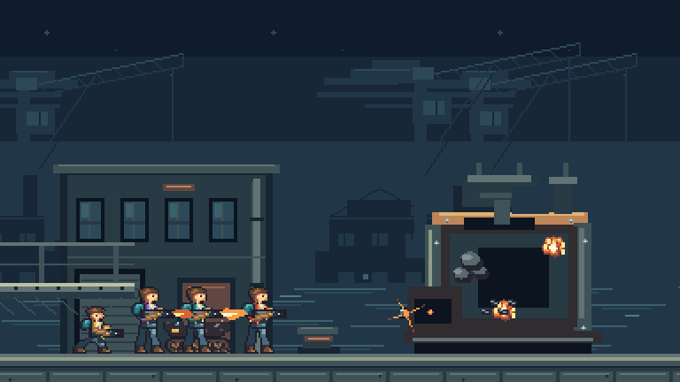

# Breakwater Approach: continuous mission candidate

This report records the effects/music/co-op increment at `7953bb6`. [The subsequent interaction-audio report](W06-interaction-audio.md) covers the current cue set, persistent loops and mix policy, and corrects the earlier late-tank screenshot label: the continuous route uses a voluntary exit; forced ejection is proved separately.

Breakwater Approach is a continuous local mission at 384×216 native pixels. It crosses one 3,072-pixel quay, clears eight defenders, destroys a crate, uses the tank and defeats the lock engine. Complete solo, two-player and four-player recordings exercise the same deterministic combat kernel. Directors submit input intent; they never change positions, inventory, damage or outcomes directly.

| Players | Victory tick | Simulation duration | Input recording                                                | Normal clean capture                                             |
| ------- | -----------: | ------------------: | -------------------------------------------------------------- | ---------------------------------------------------------------- |
| One     |        2,949 |             49.15 s | [Solo](style-v2/mission-effects/solo/solo.recording.json)      | [Watch](style-v2/mission-effects/solo/solo-clean-normal.mp4)     |
| Two     |        2,957 |             49.28 s | [Co-op](style-v2/mission-effects/coop-2/coop-2.recording.json) | [Watch](style-v2/mission-effects/coop-2/coop-2-clean-normal.mp4) |
| Four    |        3,296 |             54.93 s | [Co-op](style-v2/mission-effects/coop-4/coop-4.recording.json) | [Watch](style-v2/mission-effects/coop-4/coop-4-clean-normal.mp4) |

Run `pnpm dev:lab` and open `http://localhost:8787/benchmark.html`. The page accepts keyboard and standard gamepad input, one to four local slots, a seed, collision overlays, reduced effects, separate effects/music volumes and normal/quarter playback. Save, replay or import an input recording. The mission has its own format-1 recording and content digest; protocol 3.11, archive 12 and format-9 combat recordings are unchanged. Ordinary builds exclude the mission page.

The route exercises movement, reversal, crouch, jump/drop and vertical aim; HMG, shotgun and flame pickups; grenades and shields; death and protected re-entry; tank boarding, driving, firing, jumping, landing, damage and ejection; and a boss whose recovery aperture admits damage while its armor blocks shots. Co-op directors regroup before the boss and spread out to keep all four palettes readable. Every player participates in the boss fight and survives the final boundary. The 3,600-tick inspector limit is not a production campaign time limit. LDtk campaign authoring, production rooms and network integration remain open.

## Native presentation

The benchmark contains 329 original indexed-pixel drawings and 767 atlas entries: 119 operative drawings in four palettes, 73 enemy/tank drawings, 25 scenery/boss drawings and 112 effect drawings. The operative atlas is now 1088×2040; all 476 frame pixel hashes remain identical after repacking. Every native atlas fits the 2048-pixel dimension limit; the seven native textures occupy 24,430,080 RGBA bytes against the 64 MiB proposal. Sources, exports and license records remain checked in.

Nineteen effect clips cover directional muzzle flashes, tracers, grenades, material impacts, a twelve-drawing explosion, smoke, debris, landing dust, pickups and shotgun/flame volumes. Accepted events create bounded cosmetic instances; discarded effects never own damage. Area sprites crop to authoritative wall-clipped volumes in all four cardinal directions. Boss hits have a separate six-tick presentation clock. Reduced effects removes decorative debris/smoke and lowers intense flashes without changing gameplay.

The transient pool is bounded at 128 instances. A terminal mission receives 60 presentation ticks for effect decay while its world and input recording stay frozen. Normal playback adds one second; quarter playback adds four. Rendering reuses native images and keeps sprite positions at integer pixels.

| Review material  | Native size                                                           | Enlarged or alternate ground                                                                                                                   |
| ---------------- | --------------------------------------------------------------------- | ---------------------------------------------------------------------------------------------------------------------------------------------- |
| Weapon exposures | [White](style-v2/mission-effects/sheets/operative-white-1x.png)       | [4× black](style-v2/mission-effects/sheets/operative-black-4x.png)                                                                             |
| Quay exposures   | [White](style-v2/mission-effects/sheets/breakwater-quay-white-1x.png) | [4× gray](style-v2/mission-effects/sheets/breakwater-quay-gray-4x.png)                                                                         |
| Engine exposures | [White](style-v2/mission-effects/sheets/lock-engine-white-1x.png)     | [Cyan](style-v2/mission-effects/sheets/lock-engine-cyan-1x.png)                                                                                |
| Effects          | [White](style-v2/mission-effects/sheets/breakwater-fx-white-1x.png)   | [4× black](style-v2/mission-effects/sheets/breakwater-fx-black-4x.png), [magenta](style-v2/mission-effects/sheets/breakwater-fx-chroma-1x.png) |

`pnpm exec tsx scripts/assets/review-breakwater.ts` exports all forty black/white/gray/cyan/magenta contact sheets at native size and integer 4× enlargement. These pixel and timing checks establish consistency; anatomy, acting, effects craft and readability still require human review.

## Music and sound

Two original 16-bar arrangements, **Brass and Salt** and **Counterpressure**, use recorded trumpet, marimba, pizzicato bass and percussion. The [editable score, six CC0 source recordings, provenance and lossless masters](../../audio/source/README.md) are retained. `pnpm audio:render` produces runtime Vorbis files; `pnpm audio:validate` checks fingerprints and decoded lengths, headroom and loop seams. The two 26⅔-second tracks total 891,686 compressed bytes and 20,480,000 decoded bytes.

The music bus owns a local musical clock. Boss activation schedules the second arrangement at the next bar with a one-beat crossfade. Music stays at normal tempo during quarter-speed visual inspection. Pause preserves position, music mute preserves its clock, replay resets playback and terminal completion fades out. Gesture unlock, separate volumes, persisted preferences and page teardown are exercised in Chromium. Both lossy files also render through two complete loops in `OfflineAudioContext`.

The first four-player capture exposed 52 dropped cues under the old 24-voice limit. An independent schedule reconstruction reached 33 simultaneous sounds, including 22 lingering light impacts. Impact/shield tails now end after 160/180 ms with a fade, and the bounded sample pool holds 32 voices. The four-player normal captures retain all 1,987 cues, peak at 29 voices and drop none. The full encounter decodes to 22,542,372 audio bytes against the 32 MiB proposal. Capture reports record signal levels and clocks. Distinct final interaction sounds, persistent engine/flame treatment, complete priority policy and listening review are still required.

## Verification and limits

`CHECKPOINT_DISABLE=1 pnpm check` passes 629 tests across 65 files, including source/export and audio validation, TypeScript, production client/Worker dry run and CDK Terrain synthesis. Effect tests cover authority isolation, lifetime/budget limits, terminal cleanup and cardinal wall cropping. Full co-op recordings are independently replayed, including participation and final survival checks.

`pnpm test:mission:breakwater` compares all accepted simulation and visual boundaries in Node and Chromium, verifies import/replay identity after selector edits and checks actual keyboard short taps/focus loss. Injected standard gamepads exercise neutral barriers, replacement, disconnect and mapping rejection. Add `--players=2` or `--players=4` for a full co-op run. Each harness captures eighteen clean/debug screenshots at exact 2× pixels and complete clean/debug normal-speed plus clean quarter-speed videos with music. `--all-videos` runs the full clean/debug, normal/quarter, music-on/off combination set.

An independent [stereo media audit](style-v2/mission-effects/media-audit.json) checks both channels of all eighteen raw/published files. It caught overshoot introduced by 96 kbit/s AAC exports despite clean raw WebM. Exports now use 192 kbit/s AAC using the fast search coder with 1 dB of reserve; the retained H.264 video and original capture clocks are unchanged. The [encoding diagnosis](style-v2/mission-effects/encoding-diagnosis.json) records the original peaks and file fingerprints.

The [artifact manifest](style-v2/mission-effects/artifacts.json) pins screenshots, videos, input recordings, compressed reports, contact sheets and source fingerprints. It also records native texture memory and the captured browser bundle. [Operative](style-v2/mission-effects/operative-regression.json.gz) and [cast](style-v2/mission-effects/cast-regression.json.gz) regressions cover the repacked frame pixels, recording imports and existing sample playback. Earlier [mission evidence](style-v2/mission/artifacts.json) remains unchanged at its original revision.

Headless captures explicitly use Chromium's `--disable-audio-output` stream. Earlier isolated controls reproduced host audio-clock stalls without the game, whereas this stream maintained WebAudio/monotonic agreement. The graph and MediaRecorder still run; physical-device output is unverified. [Earlier controls](style-v2/mission/audio-diagnostics.json) retain that diagnosis. Capture guards require zero dropped cues, expected duration, aligned audio/browser clocks and a non-silent, unclipped signal. Host wall time still differs from browser monotonic time; no host clock or audio settings were changed.

W06 remains open. Complete music-on/off and debug-quarter footage, reduced-effects review, final acting/interaction audio and human style/listening acceptance are still required. Production v3, independent timing/impairment checks, the full weapon/vehicle/campaign matrix, results/outbox and rematch also remain open. Human style approval has not been requested or granted.

Wrangler still enables traces, invocation logs and source-map uploads at full diagnostic sampling; the [current source/generated configuration audit](style-v2/mission-effects/observability.json) remains available. No deployment or live trace ingestion is claimed by this increment.
