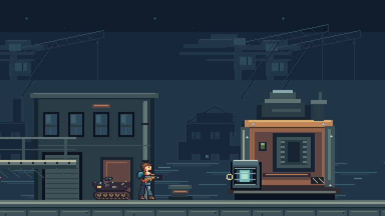

# Breakwater Approach: continuous mission candidate

Breakwater Approach is a continuous local mission at 384×216 native pixels. Its solo input recording reaches victory at tick 2,949, or 49.15 seconds at 60 Hz. It crosses one 3,072-pixel quay, clears all eight defenders, destroys a crate, uses the tank and defeats the lock engine. No demonstration command changes positions, health, inventory or outcomes directly.

Run `pnpm dev:lab` and open `http://localhost:8787/benchmark.html`. The page accepts keyboard and standard gamepad input, one to four local slots, a seed, collision overlays, sound and normal/quarter playback. Save a recording, replay it, or import the [solo recording](style-v2/mission/solo.recording.json). The new mission has its own format-1 recording with a content digest; it does not change format-9 combat recordings, protocol 3.11 or archive 12. Ordinary builds exclude the mission page.

## What the run exercises

| Passage           | Recorded behavior                                                                                                                  |
| ----------------- | ---------------------------------------------------------------------------------------------------------------------------------- |
| Loading apron     | Move, reverse, jump/drop, crouch and vertical sidearm aim                                                                          |
| Catwalk defenders | HMG pickup, grenade throw, elevated rifle target and shotgun fire while avoiding a shield bash                                     |
| Barricade         | One real infantry death and protected re-entry, flame pickup, material-driven shield break and crate destruction                   |
| Tank section      | Board, drive, fire, jump onto/over the raised quay, land, receive damage and leave the seat before destruction                     |
| Lock engine       | Closed armor blocks shots; the recovery aperture admits damage; victory requires both the engine and defender roster to be cleared |

The mission passes explicit terrain, destructibles, activation, checkpoint entries and external hurtboxes into the existing deterministic combat kernel. It does not implement another movement or collision solver. Two defects exposed by this longer route are covered by regressions: grenade hand clearance now uses the actual terrain, and sleeping enemies retain their collision material so a long-range projectile cannot bypass a shield before activation. An impact can activate that defender without bypassing encounter accounting.

Mission content is authored TypeScript with a compiled digest. Integration with the LDtk campaign authoring pipeline, production room state and protocol snapshots remains open. The inspector bounds recordings to 3,600 ticks; this is not a production campaign time limit.

## Native art candidates

The operative adds 44 original weapon drawings and 18 clips: nine HMG headings plus crouch, shotgun recoil/recovery and flame pulses. These join the existing movement, sidearm, knife, grenade and life tracks, giving 119 source drawings and 476 palette frames. Every release marker checks its native muzzle against the simulation; actual aimed and reflected releases are exercised in tests. Final weapon acting and feel still need review.

Eighteen original quay tiles provide the sky, water, warehouses, cranes, platforms, lamps, supply caches and crate. Seven lock-engine drawings cover idle, anticipation, firing/recoil, an open aperture, hit and wreck candidates. Sources remain editable indexed-pixel rows, exported through the existing asset pipeline and registered in the licence/provenance manifest. The hit drawing is not yet connected to a sustained damage presentation clock.

| Review material              | Files                                                                                                                                                                              |
| ---------------------------- | ---------------------------------------------------------------------------------------------------------------------------------------------------------------------------------- |
| Weapon source exposures      | [Native white](style-v2/mission/operative-white-1x.png), [4× black](style-v2/mission/operative-black-4x.png), [chroma](style-v2/mission/operative-chroma-1x.png)                   |
| Quay source exposures        | [Native white](style-v2/mission/breakwater-quay-white-1x.png), [4× black](style-v2/mission/breakwater-quay-black-4x.png), [chroma](style-v2/mission/breakwater-quay-chroma-1x.png) |
| Engine source exposures      | [Native white](style-v2/mission/lock-engine-white-1x.png), [4× black](style-v2/mission/lock-engine-black-4x.png), [chroma](style-v2/mission/lock-engine-chroma-1x.png)             |
| Continuous recordings        | [Normal clean](style-v2/mission/solo-clean-normal.mp4), [normal debug](style-v2/mission/solo-debug-normal.mp4), [quarter clean](style-v2/mission/solo-clean-quarter.mp4)           |
| State, images and provenance | [Browser report](style-v2/mission/report.json.gz), [artifact and source fingerprints](style-v2/mission/artifacts.json)                                                             |

Sound uses the existing licensed sample mix, now panned around the scrolling camera, with pickup/checkpoint cues and a natural tail at the end of playback. Repeated weapon samples have short faded tails: the former tank sample lasted about 2.2 seconds at its playback rate while the gun fired twelve times per second, exceeding the 24-voice budget. It remains a candidate mix: bespoke boss/tank death treatment, complete interaction sounds, voice/acting direction and authored music are not finished. Projectile trails, area volumes and impact/explosion outlines still use engineering graphics. Human W06 approval has not been requested or granted.

## Browser capture diagnosis

Long captures exposed a separate audio-clock failure on this WSL host. The AudioContext stayed `running` while its clock stalled, leaving scheduled samples active and dropping later cues. A control that only looped one licensed sample, with no game, Phaser or recorder, reproduced the drift:

| Chromium output setting  | Browser monotonic seconds | AudioContext seconds |
| ------------------------ | ------------------------: | -------------------: |
| Default Playwright mute  |                   50.0153 |              42.2719 |
| Mute flag removed        |                   50.0166 |               2.5774 |
| `--disable-audio-output` |                   50.0161 |              50.0100 |

Chromium's [audio manager selects a fake output stream for this switch](https://github.com/chromium/chromium/blob/main/media/audio/audio_manager_base.cc#L562). The mission and cast harnesses explicitly use it for headless captures; the normal game keeps its ordinary audio output. Samples still run through the real WebAudio graph and MediaRecorder. This establishes a usable automated capture path, not physical-device playback acceptance or a root-cause diagnosis of the host audio backend. Wall time also differed from browser monotonic time; no host clock or audio configuration was changed.

Run `node scripts/probe-browser-audio.mjs muted`, `unmuted` or `disabled-output`, with `EDGEFALL_CHROMIUM_PATH` when needed, to repeat the isolated 50-second control. Retained [clock diagnostics](style-v2/mission/audio-diagnostics.json) include the failed capture and controls. Capture guards still require zero dropped cues, audio/monotonic agreement, the expected video duration and a non-silent, unclipped decoded signal.

## Validation and remaining gate

`CHECKPOINT_DISABLE=1 pnpm check` passes 621 tests across 64 files, including asset/content identity, TypeScript, the production client/Worker dry run and CDK Terrain synthesis. The current [operative regression](style-v2/mission/operative-regression.json.gz) restores 17 recordings, compares 13 rendered poses against native pixels and reviews 37 clips plus all eight run frames. The current [cast regression](style-v2/mission/cast-regression.json.gz) retains four scenes, 455 boundaries, ten pixel comparisons and six videos. Their historical evidence directories remain pinned to the earlier revisions.

`pnpm test:mission:breakwater` compares all 2,949 accepted boundaries between Node and Chromium, restores the complete recording, checks import and replay identity after edited selectors, and verifies real keyboard short taps and focus loss. Injected gamepads exercise attach/replacement neutral barriers, disconnect clearing and unknown-mapping rejection; physical controllers remain unverified. Eighteen clean/debug screenshots preserve exact 2× native pixels. Three actual canvas/WebAudio videos replay the same input at normal/quarter speed and are checked against the expected duration. `pnpm exec tsx scripts/assets/review-breakwater.ts` rebuilds all native/enlarged black, white and chroma contact sheets.

The passing videos last 49.625 seconds (clean normal), 49.619 seconds (debug normal) and 197.100 seconds (clean quarter), including the final sound tail. Each plays all 575 cues with zero drops; audio time differs from browser monotonic time by at most 9 milliseconds. Decoded audio peaks remain below 0.53, and each capture has a nonzero RMS signal. The raw WebM streams and per-capture clock reports are retained with the MP4 exports.

Two- and four-slot checks compare 100 local boundaries and independently claimed pickups; they are not full co-op playthroughs or network evidence. Full solo/two/four-player clean/debug normal/quarter captures with final effects and music on/off remain necessary for the human style gate. Production v3, deployed traces/cadence, independent timing/impairment checks and the full weapon/vehicle/campaign/results/rematch work also remain open.

The [local deployment configuration audit](style-v2/mission/observability.json) retains enabled traces, invocation logs and source maps with full diagnostic sampling in both source and generated Wrangler configurations. [Production isolation](style-v2/mission/production-isolation.json) verifies that ordinary builds exclude the benchmark and inspector pages. No deployment or live trace ingestion is claimed by this increment.
