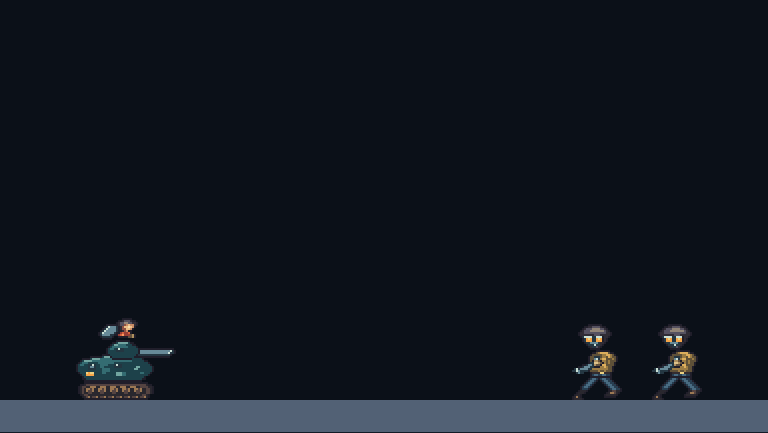

# W06 native enemies, tank and sound mix

Quay Watch, Breakwater and Kestrel now render as original indexed-pixel candidates in the local combat inspector. This is a representative cast increment. The continuous 45–60-second mission lane, complete environment/effects/weapon acting, authored score and human style approval remain open.

| Candidate                 | Original drawings |               Exported frames | Source and review sheets                                                                                                                                          |
| ------------------------- | ----------------: | ----------------------------: | ----------------------------------------------------------------------------------------------------------------------------------------------------------------- |
| Quay Watch rifle sentry   |                19 |                            19 | [Source](../../art/source/enemies/quay-watch.pixels.json), [native light](style-v2/cast/quay-watch-light-1x.png), [4× dark](style-v2/cast/quay-watch-dark-4x.png) |
| Breakwater shield carrier |                27 |                            27 | [Source](../../art/source/enemies/breakwater.pixels.json), [native light](style-v2/cast/breakwater-light-1x.png), [4× dark](style-v2/cast/breakwater-dark-4x.png) |
| Kestrel tracked tank      |                27 | 108 across four crew palettes | [Source](../../art/source/vehicles/kestrel.pixels.json), [native light](style-v2/cast/kestrel-light-1x.png), [4× dark](style-v2/cast/kestrel-dark-4x.png)         |

The 73 new drawings produce 154 atlas frames. The existing operative remains 75 drawings and 300 palette frames. Sources contain editable, literal palette-indexed rows; exports use the existing deterministic sharp pipeline. No reference pixels are sampled. All exports, original-source declarations and hashes are registered in the runtime manifest and source provenance. [Byte-exact export, alpha and timing audit](style-v2/native-cast.json).

## Play and inspect

Run `pnpm dev:lab`, open `/combat-lab.html?cast=1`, enable sound, then focus the surface. The existing rifle, guard and tank scenes use accepted simulation state for facing, burst timing, protection/break phases, turret heading, recoil, seat transfer and grounded death drawings. The original simulation, protocol 3.11, archive 12 and recording 9 are unchanged.

“Play recording” runs captured input at normal or quarter speed. “Check replay” and file import reconstruct the exact state and cosmetic motion clocks without playing historical sounds. The player and cast geometry controls allow repeatable review with or without those overlays. Scenery, projectile trails, area attacks and impact circles still use engineering graphics; unsupported operative weapon/action poses retain the existing fallback. The v2 product does not select these candidates, and ordinary builds exclude the inspector.

Rifle release sockets match ticks 24, 30 and 36. The shield's four active bash ticks and twelve/eight-tick tank boarding/exit clips match simulation content. Tank aim uses eight explicit world directions independently of chassis facing. Cosmetic strides advance with accepted movement, and landing compression lasts four accepted ticks after an airborne-to-ground transition. A continuing floor contact cannot restart it. Enemy death drawings require an authoritative grounded kill resolution and disappear after thirty ticks; airborne or non-kill removal does not invent a settled corpse.

## Sound and recordings

The candidate mix uses the repository's licensed [Kenney Digital Audio](https://kenney.nl/assets/digital-audio) and [Impact Sounds](https://kenney.nl/assets/impact-sounds) samples. Gains and playback rates distinguish firearm families, tank fire, shield bash/break and ordinary impacts. Movement and seat sounds follow accepted transitions; operative footsteps follow authored planted-foot changes. The browser unlocks audio on request, bounds playback to 24 simultaneous voices, and clears voices/history on reset. Sound-marker duplicates do not create additional weapon releases. Quarter-speed playback spaces events further apart while retaining sample pitch.

| Accepted input recording                                  | Clean, normal                               | Geometry, normal                            | Clean, quarter speed                         |
| --------------------------------------------------------- | ------------------------------------------- | ------------------------------------------- | -------------------------------------------- |
| [Guard, 131 ticks](style-v2/cast/guard-recording.json.gz) | [MP4](style-v2/cast/guard-clean-normal.mp4) | [MP4](style-v2/cast/guard-debug-normal.mp4) | [MP4](style-v2/cast/guard-clean-quarter.mp4) |
| [Tank, 120 ticks](style-v2/cast/tank-recording.json.gz)   | [MP4](style-v2/cast/tank-clean-normal.mp4)  | [MP4](style-v2/cast/tank-debug-normal.mp4)  | [MP4](style-v2/cast/tank-clean-quarter.mp4)  |

Each row replays the same input to the same final state and cast frames. Videos capture the real inspector canvas and Web Audio destination together; they are enlarged 4× with nearest-neighbor scaling. The MP4 export fills timestamped audio gaps with silence. PNG captures remain the lossless pixel reference. These separate diagnostic scenes are not the required continuous benchmark, a musical arrangement, four independent network clients or a human sound-quality approval.

## Verification and remaining work

`pnpm test:art:cast` compares Node/browser state and selected cast frames at all 455 accepted boundaries across rifle, shield, tank and four-slot runs. It also verifies sound intents, bounded voices, zero dropped cues, four replay/import restorations and six real-time captures. Ten screenshots compare visible native pixels against decoded atlas pixels at every integer-scaled sample, excluding the inspector's deliberate projectile/impact overdraw. Video durations are checked against tick count and playback speed; decoded audio must be audible and remain below clipping. [Browser report](style-v2/cast/report.json.gz), [artifacts and source fingerprints](style-v2/cast/artifacts.json).

The six cast unit cases cover rifle release sockets/reflection, distinct bash playback, genuine tank landing transitions, world turret directions/four crew palettes, valid corpse presentation and authored footfall cadence. Required `CHECKPOINT_DISABLE=1 pnpm check` passes 610 tests across 63 files, along with lint, asset/content validation, typechecking, the Worker dry run and infrastructure synthesis. The existing native-operative browser regression also passes; exact results and logs are retained with this increment. [Production isolation and observability settings](style-v2/cast/production-isolation.json) confirm that ordinary builds exclude the inspectors and source/generated Wrangler configurations preserve full trace/invocation-log sampling and source maps. No deployment or live trace retrieval was performed.

Next, build one original mission lane around these candidates with representative weapons, a destructible prop, mechanical boss target, layered scenery and effects. Refine airborne/landing, vertical aim/recovery, crew/ejection and hurt acting within that lane, and add the authored music/effects mix. Capture solo, two- and four-player clean/debug pairs at normal/quarter speed with music on/off before requesting the full human style review. Production v3 integration, independent network/host-clock validation, deployed tracing and the campaign/result/rematch work remain separate open gates.
