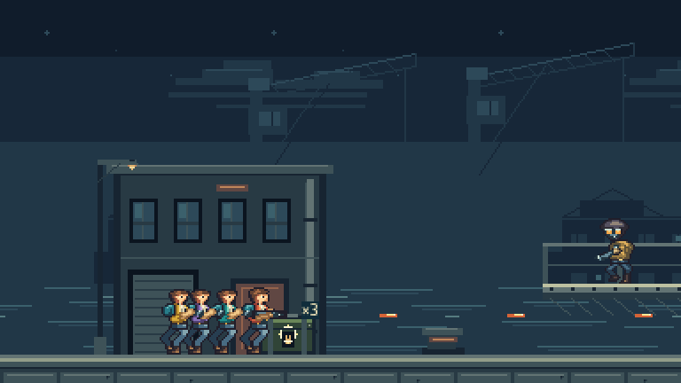

# Individual weapon supplies

Breakwater now uses individual authoritative items instead of per-player caches. Each item has a content definition, spawn source, unique claim ID, activation tick, expiry and a supported sensor rectangle. One player wins each item by earliest accepted collision time, then player slot; equal-time items use claim ID. Collection occurs on contact. A finite weapon replaces the carried gun, while an identical weapon adds ammunition up to its configured capacity. A full inventory leaves the item available.

The benchmark supplies one separate item per participating player at each station, with no reservation by slot. The existing crate art shows the number remaining. Contact-entry latches prevent a player holding Fire from consuming the remaining pile one round at a time: another claim requires leaving and re-entering the sensor. These latches survive saved-state continuation. All three demonstrated parties share the supplies successfully, including a boss station where contact order differs from slot order.

Swapping a firearm preserves its paid cooldown, shot ordinal, last action identity and control epoch. It cancels the old firearm's unconsumed markers and attached beam, while preserving released attacks and independently accepted knife/grenade actions. A matching-ammunition grant preserves the current firing action and aim state. Claims retain the previous/new weapon and ammunition amounts for a brief pickup effect and inventory diagnosis. End-of-tick death and seat transitions make an actor ineligible.

## Collision and continuation

The common movement solver now returns at most five accepted residual intervals, including collision stops and slides. Pickup queries stop at each interval's collision boundary instead of treating the entire intended displacement or the chord between endpoints as unobstructed travel. Temporary BigInt fractions compare whole-tick contact order exactly; stored state remains bounded JSON integers. The movement result is diagnostic step output, and adds no field to the existing public player snapshot.

The supply state has a 64-item and 256-contact budget. Its validator checks exact fields, roster and claim identities, availability/expiry boundaries, claimant membership and contact ordering. Authored ground supplies require stationary, unobstructed support. A destroyed or invalid support retires the item; the benchmark does not leave a floating reward. Moving pickup bodies, vehicle repair and team rewards remain separate work.

Breakwater mission and recording format **2** replace format 1, and the content digest includes all four party-size supply definitions. The supply state itself is format **1**. Old mission recordings reject explicitly. Diagnostic combat protocol 3.12, archive 14 and recording 11 retain their existing layouts; pickup integration into that room and its durable archive is still required.

## Validation

`pnpm check` passes **793 tests across 74 files**, including 27 pickup cases. The new coverage includes swept and simultaneous contention, collision stops/slides, item ordering, every finite weapon, capped additions, preserved cooldown/action identity, contact-entry recovery, pile sharing, unavailable actors, exact activation/expiry, lost support, invalid state and exhaustion fallback. The complete mission audio/effects checks use the same 20-second test-runner limit as the existing full mission replay tests; all assertions remain. A preceding five-second timeout is retained in the evidence package. These limits are separate from runtime timing acceptance.

Node 24.20.0, Chromium 153.0.8010.12 and local workerd through Wrangler 4.128.0 agree on a 180-tick four-controller route through all five finite weapon families. Each player claims five distinct items; the route produces twenty claims and eight laser shots at ticks 100 and 106 before all four players fall back to the sidearm. Candidate insertion order is reversed at every boundary without changing authority. Forty-three JSON checkpoints resume for fifteen ticks with identical state, including contact latches. Final hash is `5c705f5f`; trace hash is `61eb6985`.

The complete browser mission runs use installed Chromium 151.0.7922.34 and the existing native assets. Every noninitial simulation and visual boundary matches Node, followed by complete recording import/replay. The verifier reads actual Phaser supply visibility and count text, comparing them with the independently accumulated claim events. Selected screenshots retain the claim effect and remaining pile. The input-only director maintains its distance from the flame-section guard so the changed pickup timing still demonstrates a shield break.

| Players | Victory tick | Individual claims | Checked render boundaries | Captured stills |
| ------- | ------------ | ----------------- | ------------------------- | --------------- |
| 1       | 3,036        | 5                 | 28                        | 56              |
| 2       | 3,044        | 10                | 28                        | 56              |
| 4       | 2,992        | 20                | 29                        | 58              |

All players participate and remain alive at the final boundary. The runs retain boarding, tank motion/damage, forced ejection, enemy resolution and the boss outcome. Real keyboard short taps/focus loss and injected gamepad connection barriers also pass. The solo run verifies music controls and browser audio decoding. These runs exercise local browser mission replay; network delivery remains a separate gate. No new review movies or final media were produced; the published W06 review remains pinned to its original capture and awaits its existing human review.

The immutable [evidence manifest](weapon-pickups-2026-09-08/artifacts.json) retains 379 source fingerprints, one bundled dependency and 54 artifacts totaling 2,293,700 bytes. It includes both tested bundles, complete reports, three mission recordings, 36 selected supply/victory screenshots and the final project check. Manifest SHA-256 is `0530ff1b486e28d759fa1fce5bab26b5fc645aba97db239a60d9dc87ec2dcfa7`. Bundle rebuilds and source fingerprints bind the reports to this increment; the report base commit precedes these changes.

The four-player run after its first claim shows three items remaining:



```sh
pnpm check
pnpm test:contracts
EDGEFALL_CHROMIUM_PATH=/path/to/chrome pnpm test:mission:breakwater --no-video
EDGEFALL_CHROMIUM_PATH=/path/to/chrome pnpm test:mission:breakwater --no-video --players=2
EDGEFALL_CHROMIUM_PATH=/path/to/chrome pnpm test:mission:breakwater --no-video --players=4
```

## Remaining work

The next integration must put item availability, contact-entry latches and claim events into the authoritative diagnostic room transaction, acknowledged snapshots/events and exact archives, then prove SQLite rollback/restarts and actual network delivery. W07 also retains the wider material/pickup/mission introduction matrix and final media. Production v3, W08 vehicles, Harbor/Foundry/Carrier and full campaign acceptance remain open. Worker tracing, invocation logs and source maps are configured; [deployed ingestion](../observability.md) and cadence remain unverified. The conformance and mission durations do not establish per-tick CPU performance.
