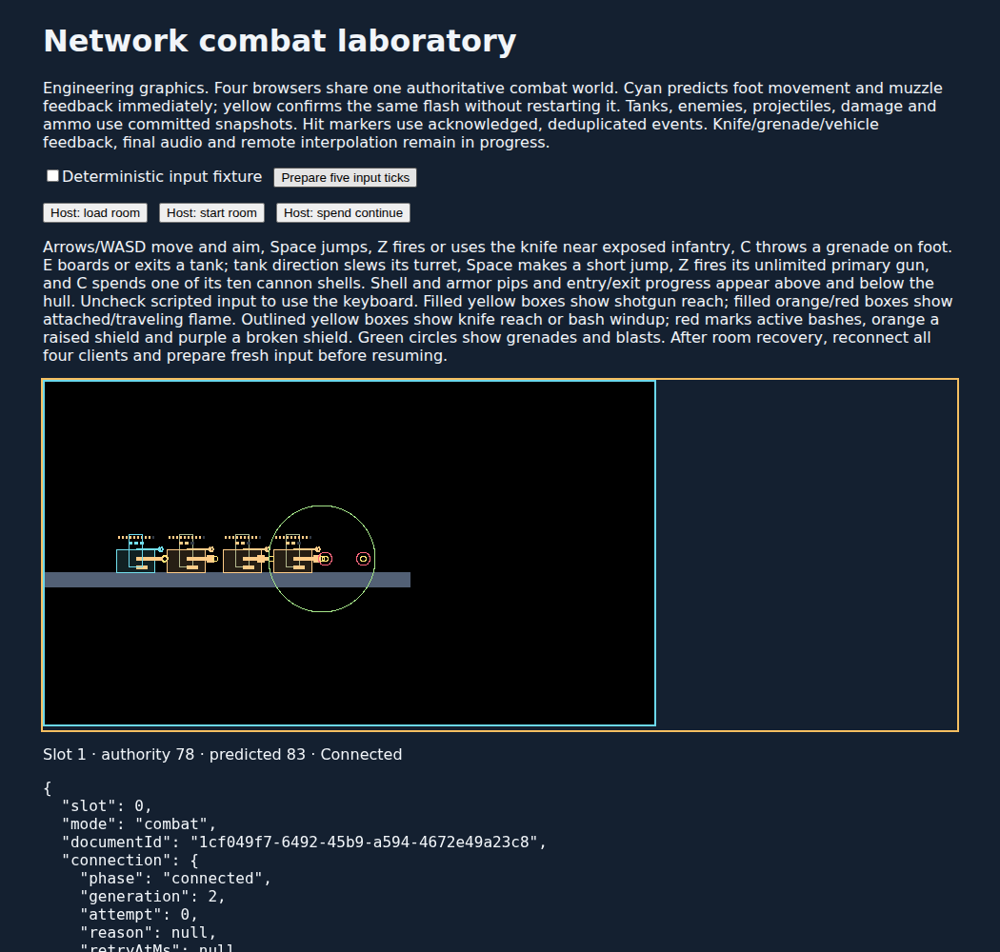

# W08 tank cannon engineering checkpoint

The deterministic tank laboratory and authoritative diagnostic room now support a finite cannon alongside the unlimited primary gun. While occupied, C starts one cannon action and spends one of ten depot shells. Fire, movement and jump continue independently. Holding C does not repeat; exiting before release cancels the action without refunding its shell.

The cannon locks one of eight authored headings, releases at action offset three, and finishes its twelve-tick recoil exposure. Cardinal shells travel twelve logical pixels per tick; diagonals travel eight per axis. An 8-by-8 swept body produces one 56-pixel-radius blast at contact, with six damage and at most one grant per entity. Direct contact contributes no additional damage. Blast damage and occlusion use the existing material policies; the physical shell still strikes solids such as open grating. A shell without contact expires after ninety flight ticks. Released shells retain their original owner and action through exit, disconnect, recovery and hull destruction.

Primary and secondary hardpoints share a monotonically increasing shot-ordinal space and retain separate action clocks, cooldowns and last-owner attribution. This prevents simultaneous hardpoints from sharing a confirmation key. Protocol 3.15 adds forty bytes per vehicle for the secondary state; vehicle records are 364 bytes and the full allocation bound is 53,728 bytes. Archive 18 and combat simulation/recording 15 reject earlier experiments. See the [archive contract](../combat-checkpoint-v18.md) and [wire layout](../snapshot-v3.md).

| Validation                      | Result                                                                                                                                                                                                                                                                                                                                                                                       |
| ------------------------------- | -------------------------------------------------------------------------------------------------------------------------------------------------------------------------------------------------------------------------------------------------------------------------------------------------------------------------------------------------------------------------------------------- |
| `pnpm check`                    | 857 tests in 79 files, including eighteen new cannon cases; 28.75 seconds for Vitest. Lint, assets, art/audio integrity, compiled content, independent protocol packing, TypeScript, client/Worker dry build and CDK Terrain synthesis pass. The pre-existing optional-chain lint warning remains.                                                                                           |
| Node / Chromium / local workerd | Exact agreement on solo and four-player 175-tick runs, 875 duplicate packets and thirty wire/checkpoint/journal boundaries. Each party spends three shells, releases two and cancels the third by exiting.                                                                                                                                                                                   |
| Actual SQLite storage           | Sixteen four-player boundaries restored in fresh workerd processes, including pre-release, released flight, cancellation, exit and expiry. Each journal commit is preceded by an injected transaction rollback; archives stay within six rows.                                                                                                                                               |
| Local keyboard inspector        | Seven exported recordings restore exactly at ticks 20, 21, 65, 66, 109, 110 and 117. The final tank retains seven shells and the driver retains all three lives and ten foot grenades.                                                                                                                                                                                                       |
| Four real network clients       | Every player spends two shells and retains eight. Holding the first trigger through tick 124 causes no repeat after release by tick 76; a fresh press releases the second batch by tick 141. All four clients agree on fifteen post-exit snapshots and 47 events, suppress 63 duplicates, observe cannon recoil, preserve shells through exit, and retain three lives through room tick 223. |

The complete cross-runtime suite took 44.258 seconds in Node, 37.438 seconds for the local workerd request and 35.928 seconds in Chromium. These are conformance workload durations, not room tick CPU benchmarks. Its result SHA-256 is `a010ce57d9571d083a49d8d2b979fb503289bacdcccbf39afb0e17ae0afbfb0d`.

The [immutable evidence package](tank-cannon-2026-09-08/artifacts.json) retains 418 source fingerprints, one dependency fingerprint and 47 artifacts totaling 6,015,819 bytes. Five rebuilt bundles match the tested bytes: contract browser, SQLite Worker, network Worker, network client and local combat inspector. Reports, recordings, screenshots, validation logs and the curator are included. The manifest SHA-256 is `9bfdae598f188617e873da4e718b0d840d60782f53022b86a0af6b9e389245f5`. The [compact result](tank-cannon-2026-09-08/summary.json) includes checkpoint hashes and merged cannon event evidence before retention removes old events.

The package also retains the failed initial type check, two incorrect fixture assumptions, the stale generated mission digest, and three old wire byte/version expectations. Those failures were corrected before the final required check. No failed browser or SQLite run is omitted.

This advances the missing W08 cannon behavior while the unanswered W06 style review remains pending. W07 final weapon authoring and mission introductions, the remainder of W08 component/sacrifice/lifecycle and degraded-network coverage, final cannon art/audio, W09 Harbor, production v3 integration and the complete campaign remain unfinished. The barrel and blast overlays are engineering graphics; no remaining final media was produced. Traces, invocation logs and source maps remain configured. Live trace ingestion and deployed cadence remain unverified; this checkpoint uses local workerd only.
