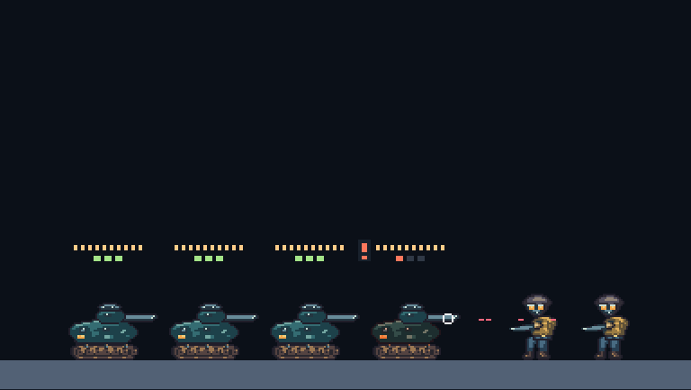

# W08: accepted tank damage feedback

Tank damage now produces a brief hit reaction, persistent hull modulation and a critical armor indicator in the native candidate renderer. Armor and shell counts remain visible with collision overlays hidden, above the highest authored muzzle. The critical exclamation mark remains present through its bright/dim phases, and critical smoke survives reduced cosmetic effects. These are engineering changes using the existing media; they do not approve final damage drawings or sound design.

Protected contacts previously played the armor-loss sound, and tank impacts used the flesh effect. Contacts now use metal effects and audio, while the armor-loss cue belongs to the accepted armor transition and tank emitter. The recorded four-player fixture has thirteen contacts but only three armor debits, at ticks 37, 110 and 183. Duplicate consumption cannot replay a cue. Restoring a critical checkpoint reconstructs current engines and indicators without playing historical damage.

The six-tick hit reaction derives from the existing thirty-tick damage protection timer. No new simulation state, wire fields or archive version is required: protocol 3.16 and [archive 19](../combat-checkpoint-v19.md) remain current. Both tank hardpoints and the full hull hurtbox remain operational at one armor pip. Destruction removes the hurtbox and settles the driver; sacrifice commitment is not reported as an incoming armor hit. Separate breakable weapon arms remain part of the walker design.

| Evidence                | Result                                                                                                                                                                                                                                                                                                                                                                        |
| ----------------------- | ----------------------------------------------------------------------------------------------------------------------------------------------------------------------------------------------------------------------------------------------------------------------------------------------------------------------------------------------------------------------------- |
| Required checks         | 885 tests in 81 files, including seven new feedback regressions; type checks, independent binary goldens, asset/art/audio/content validation, Worker dry build and CDK Terrain synthesis.                                                                                                                                                                                     |
| Snapshot and checkpoint | Twelve real damage boundaries reconstruct identical feedback from decoded public snapshots and fresh checkpoints, without changing accepted state.                                                                                                                                                                                                                            |
| SQLite                  | Fourteen damage boundaries restore in fresh workerd processes, including the first hit, protected contacts, critical state, expired protection, wreck and later damage. Every segment exercises rollback; at most six archive rows are retained.                                                                                                                              |
| Native browser          | Seventeen imported input boundaries pass 14,071 rendered-pixel comparisons, including fill/multiply reset and a persistent warning with overlays hidden. Normal and quarter-speed four-player recordings each reach tick 196 with 47 sound cues and armor cues at 37/110/183. Peak voice counts are 15 and 11; no critical cue is dropped.                                    |
| WebAudio                | All 52 existing samples decode. Thirteen real contacts produce thirteen metal cues and three armor-loss cues despite duplicate delivery. Ejection and destruction each play once. Critical-state resume restores four engines with no historical one-shots or trigger fetches.                                                                                                |
| Four network clients    | Actual keyboard boarding and hostile rifle fire produce all four armor stages. At room/client tick 228, peers agree on fifteen post-destruction snapshots and fifty events while suppressing 68 duplicates. Final lives are 3/3/3/2 and armor is 3/3/2/0. P4 ejects safely before a later exposed-body death; subsequent rifle fire reaches P3 through the nonblocking wreck. |

Run `pnpm test:tank:feedback`, `pnpm test:audio:combat`, `pnpm test:storage:combat`, `pnpm test:network:controller --combat-tank-damage` and `pnpm check` to repeat the gates. Browser commands use the existing Chromium executable selected by `EDGEFALL_CHROMIUM_PATH`.

The [immutable manifest](tank-feedback-2026-09-08/artifacts.json) and [compact results](tank-feedback-2026-09-08/summary.json) pin 430 source fingerprints, one dependency and fifty-seven artifacts totaling 5,243,393 bytes. Five rebuilt bundles match the tested bytes. Manifest SHA-256 is `97649b7154c521d23c9eea7001a52e800ce1c8efd4cdcc43ca8ba8b91ffec835`. Recordings, native stills, browser/SQLite/network reports, validation logs and curation code are retained.

The [controls](tank-feedback-2026-09-08/controls.json) preserve the initial native-overlay fixture failure and the first network expectation, which omitted continuing hostile fire after P4's destruction. The failed network capture also records a later P2 mapping baseline fault; the passing independent run retains all peer and clock checks. This checkpoint does not close the broader timing or impairment investigation.

W08 remains open for final vehicle media and the complete lifecycle, geometry, reconnect and degraded-network acceptance matrix. The unanswered W06 style/listening review remains pending. Harbor, later vehicles/missions and production v3 remain separate work.

Both Wrangler configurations retain explicit traces, invocation logs and source maps with 100% sampling, consistent with [Cloudflare's tracing configuration](https://developers.cloudflare.com/workers/observability/traces/). Live trace ingestion and deployed cadence remain unverified.
