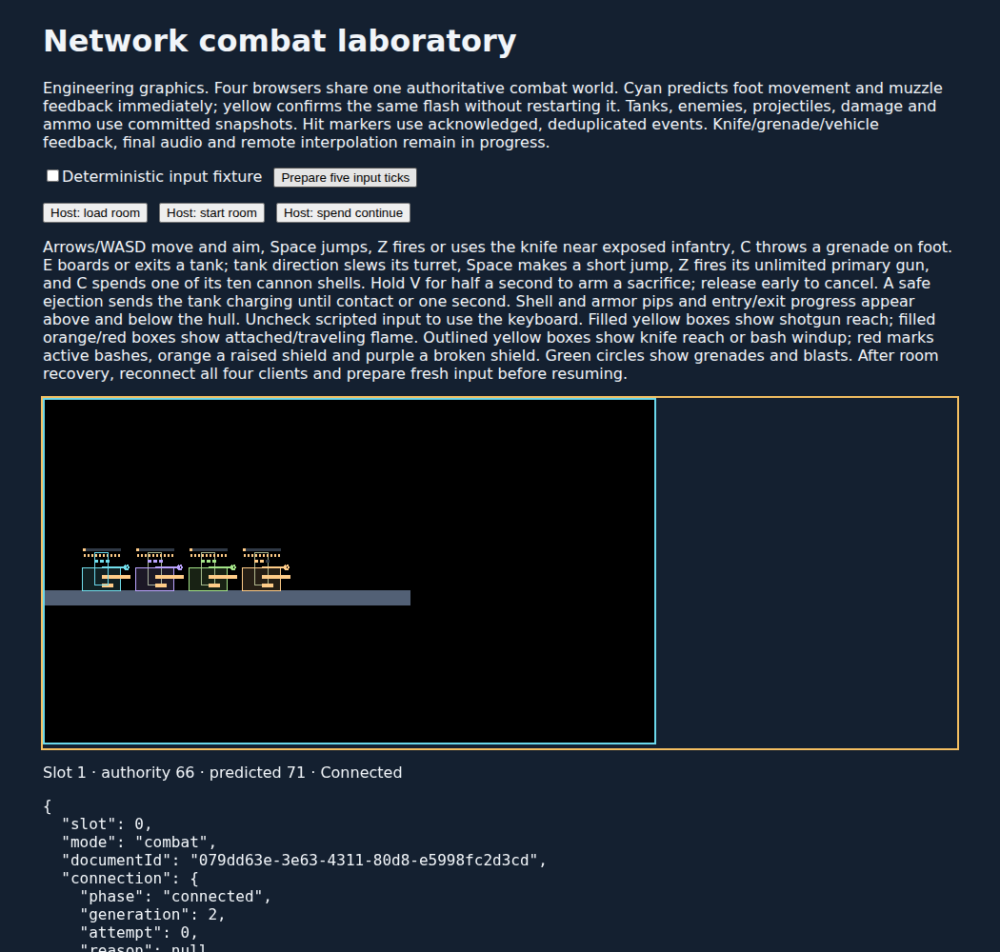

# W08: dedicated tank sacrifice

The deterministic tank now has a dedicated VehicleSpecial action: press and hold V for thirty accepted occupied ticks, release before commitment to cancel, and safely eject before sending the consumed hull into a bounded charge. Ordinary Jump/Fire never starts it. The benchmark also maps P2 Period and standard gamepad right shoulder. This is an engineering checkpoint in the inspector, Breakwater kernel and authoritative diagnostic room; it does not close W08 or the full campaign.

Arming retains a global action identity and original owner/input generation. Release, stale or disconnected control, ordinary exit and damaging hits cancel; holding alone cannot restart an attempt. Damage resolves before the final commitment check. If every authored ejection candidate is blocked, the driver stays seated and armor is retained. Successful commitment applies the normal safe-exit protection/reboard rules and advances the player input generation once. Unreleased hardpoints cancel; bullets and shells already released remain independent.

The consumed, unoccupied tank moves from the following tick at six pixels per tick in its committed horizontal direction, with the shared grounded solver. Swept physical/enemy contact, solver wall/ceiling contact or the sixtieth flight tick supplies one eight-damage, seventy-two-pixel-radius blast with a sixteen-target cap. The hull center anchors blast visibility, so ground contact cannot make damage graze beneath concrete. Open grating stops the physical hull while allowing the blast through. Moving target transforms, friendly exclusions and per-entity hit grouping remain authoritative; no additional direct hit is added. A crush or out-of-bounds fall settles the wreck without an off-stage damage volume.

Protocol 3.16 adds thirty-two bytes of public phase/identity/timing/direction state per vehicle. Vehicle records are 396 bytes and the complete snapshot ceiling is 54,240 bytes. [Archive 19](../combat-checkpoint-v19.md), combat recording 16, Breakwater recording 6 and material recording 3 reject earlier experiments. Recovery cancels occupied arming but preserves a released charge. The original owner retains kill credit after seat/control changes, and the terminal state prevents a repeated blast.

Accepted state drives an engineering arming bar and rising pitch on the existing engine sample. The native candidate hull keeps its suspension/tread animation while charging and switches to a wreck only at termination. No new art or audio was produced; final vehicle media and network audio remain open.

| Evidence                        | Result                                                                                                                                                                                                                                                                                           |
| ------------------------------- | ------------------------------------------------------------------------------------------------------------------------------------------------------------------------------------------------------------------------------------------------------------------------------------------------ |
| Required checks                 | 878 tests in 80 files, including twenty dedicated special cases and the native charge presentation regression; type checks, independent binary goldens, asset/art/audio/content validation, Worker dry build and CDK Terrain synthesis.                                                          |
| Node / Chromium / local workerd | Identical solo/four-player 130-tick runs, 650 duplicate wire inputs and twenty-six exact snapshot/checkpoint/journal continuations. The solo blast lands at tick 97. In the four-player case, a rifle hit cancels P4 at tick 37 while P1–P3 commit at 62; three charges terminate at 80/122/122. |
| Actual SQLite                   | Fourteen four-player boundaries restore in fresh workerd processes, with injected transaction rollbacks and at most six archive rows. Boundaries cover arming, voluntary/damage cancellation, commitment, active flight and terminal state.                                                      |
| Keyboard inspector              | Five exact export/import checkpoints at 26, 27, 61, 62 and 98. The driver ejects safely at 62 and keeps three lives through 98; a previously released rifle bullet hits at 109, leaving two lives. This explicitly separates ejection safety from later hostile damage.                          |
| Four network clients            | All drivers arm, cancel, rearm and commit at tick 94. Two charges fall out of bounds at 144/153; two expire with one blast each at 154. All four players retain three lives through room tick 199. Clients agree on fifteen later snapshots and 39 events while suppressing 55 duplicates.       |

The complete conformance suite took 43.918 seconds in Node, 37.280 seconds for the local workerd request and 38.784 seconds in Chromium. These are whole-suite conformance durations, not room tick CPU measurements. Result SHA-256 is `c0dacd41d2c0216ff03fa1b68959e7f9810d136f330049db26b1bad66c4d5b0b`.

The [immutable package](tank-special-2026-09-08/artifacts.json) and [compact results](tank-special-2026-09-08/summary.json) retain 425 source fingerprints, one dependency and 57 artifacts totaling 7,844,579 bytes. All five rebuilt bundles match the tested bytes. The manifest SHA-256 is `6dfb00f08fc6bfa19ec1a6f8f08c496a12fd2d61574cc3edebaad4dec0f8f888`. Reports, recordings, screenshots, validation logs and curation code are included. The controls describe schema/fixture corrections, the concrete-wall blast-origin regression and the inspector’s incorrect initial life-count expectation. The initial failed inspector output is retained separately from the passing run.

Remaining work includes W08 component/damage feedback and the broader lifecycle/impairment matrix, W07 final weapon authoring and mission introductions, W09 Harbor, production v3 integration, the full campaign and human acceptance. The unanswered W06 style review remains pending. Both Wrangler configurations still enable traces, invocation logs and source maps with 100% sampling, consistent with [Cloudflare’s explicit traces configuration](https://developers.cloudflare.com/workers/observability/traces/). Live trace ingestion and deployed cadence remain unverified.
