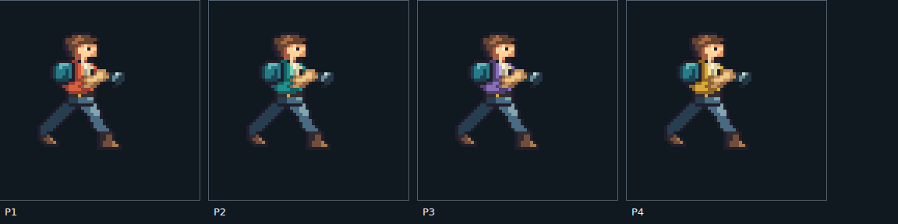

# W06 native operative and original source review

The native operative candidate now has a stronger trouser/boot silhouette, authored sidearm recoil, leg transitions and contact metadata tied to the current controller speed. The original concept studies retain their measured defects. Human style review remains pending: upper-body secondary motion, full-body actions and the representative enemy, tank, effects, scenery, audio and playable 45–60-second benchmark are still required.

## Native drawing and playback

[Editable indexed source](../../../art/source/hero/operative.pixels.json) contains literal pixel rows authored by Codex for this project, using the first concept's design as reference without sampling its pixels. The revised set has **33 drawings**: four upper aim poses, eight recoil drawings, 12 lower-body drawings and nine transition drawings. Four jacket palettes produce 132 untrimmed 64×64 atlas entries with a fixed foot root at (24,48). The atlas has two transparent padding pixels around each frame, binary alpha and normalized transparent RGB. [PNG](../../../public/assets/art/hero/operative.png), [atlas](../../../public/assets/art/hero/operative.atlas.json), [decoded-pixel/frame audit](native-frames.json).

Run `pnpm art:export` after deliberately editing the indexed source. The exporter checks native coordinates, palette/alpha rules, frame/channel references, exposures, distinct run/recoil drawings, boot contacts and authoritative sidearm release sockets before writing the PNG, atlas, manifest, source provenance and reports. `pnpm art:validate` reconstructs these files and requires byte-exact exports and matching metadata. Pixel copies and static atlas packing happen during the build; no runtime procedural figure drawing or resampled concept frames are used by this candidate. These checks cannot grant artistic acceptance.

Open `/art-review.html#native` in `pnpm dev:lab` for 1×/2×/4× views, four palettes, individual drawings, ten action/transition clip selections, mirrored previews, roots/contacts, backgrounds, stepped ticks and normal/quarter-speed playback. Pink marks the root; green marks the authored run contact. In `/combat-lab.html`, enable “Native operative candidate” and toggle player hitboxes/sockets for the engineering comparison. The candidate covers living, unseated sidearm ready/fire states. Other weapons and full-body actions retain engineering outlines. The ordinary v2 product does not select these drawings; its static build includes the registered candidate atlas, while review pages and editable source copies require the explicit lab build.

The run retains eight two-tick exposures. Contact points retreat six logical pixels per exposure, matching the current controller's three-pixel-per-tick travel on the flat benchmark floor. The compiler requires each contact to meet the floor and an adjacent boot drawing. Chromium checks that each planted foot has a constant world contact at successive exposure boundaries. This is discrete frame authoring: it does not implement subframe foot locking, and the marked point moves by up to three pixels within a held exposure. Human movement review remains necessary.

| Clip              | Duration     | Behavior in the inspector                                       |
| ----------------- | ------------ | --------------------------------------------------------------- |
| Start             | 2 ticks      | Brace and drive, then enter run frame zero.                     |
| Stop              | 2 ticks      | Brake and settle after accepted movement stops.                 |
| Reverse           | 2 ticks      | Pivot and drive while retaining the run phase.                  |
| Crouch enter/exit | 2 ticks each | Bridge the accepted posture change.                             |
| Landing           | 4 ticks      | Compress and rise; a new jump immediately cancels the pose.     |
| Sidearm fire      | 4 ticks      | Base, kick, settle, base; three distinct drawings for each aim. |

The inspector advances a bounded cosmetic motion clock once per accepted simulation tick. Upper fire age selects recoil independently, so shots cannot restart the run. A start transition establishes the run phase; reversal preserves it. The presentation clock does not delay movement, alter the authoritative actor or authorize a projectile. Stale/skipped/repeated clock ticks are rejected, and a changed control epoch starts a fresh presentation state. This is local inspector integration; production prediction, remote interpolation and baseline recovery still need to consume the presentation pipeline.

The four base upper drawings bind to sidearm poses 10–13. Every muzzle marker is checked against the exact drawing selected at that action age, and the visual clip duration must match its authoritative timeline. The release drawing uses the simulation muzzle; subsequent kick/settle drawings retract the barrel cosmetically and emit no extra shot. Recording replay reconstructs motion clocks through isolated observation copies of accepted worlds. A malformed replay cannot replace the visible state, and an observer cannot mutate the replay's simulation through its snapshot.

## Current validation and review

`CHECKPOINT_DISABLE=1 pnpm check` passes **587 tests across 60 files**, including 15 native-source/playback cases. Tests decode every authored pixel, reject malformed alpha/glyphs/bounds/muzzles/contacts/channels, verify exposure and contact contracts, prove action-independent running and interruption of landing, and check replay-observer isolation. Asset/content checks, all TypeScript targets, client/Worker dry run and CDK Terrain synthesis pass. [Current check log](native-motion/check.log.gz).

Chromium checks the actual stationary body pixels in both facings, all eight run drawings while firing, all ten recoil/transition clips, preserved gait phase, planted exposure contacts, start/stop/reverse/crouch/landing behavior, and immediate jump/fire after landing. Three UI export/import cases restore exact world and presentation state, including the run at tick 24 with phase origin 3. The existing combat and concept-review browser regressions also pass. [Browser report](native-motion/browser.json), [browser log](native-motion/browser.log.gz), [moving recording](native-motion/run-recording.json), [transition recording](native-motion/motion-recording.json), [source and artifact identity](native-motion/artifacts.json).

[Normal-speed capture](native-motion/run-fire-normal.webm) and [quarter-speed capture](native-motion/run-fire-quarter.webm) retain actual local run/reverse/fire. Videos are 768×432 at Playwright's 25 fps capture cadence, distinct from 60 Hz simulation; quarter speed is useful for one-tick recoil drawings. [Native scale](native-motion/palettes-1x.png), [kick](native-motion/recoil-kick.png), [settle](native-motion/recoil-settle.png), [landing](native-motion/landing.png), [downward aim](native-motion/air-down.png) and [debug comparison](native-motion/air-down-debug.png). Native/scaled images and sampled video frames were inspected. These are local captures without audio or multiplayer, not the complete benchmark or a controller-feel acceptance test.

The trouser and boot contours carry more mass than the [first native candidate at `4e8e373`](https://github.com/garysassano/cdktn-cloudflare-edgefall/blob/4e8e37309771ba1c4788cab762f9b96d93eb5918/docs/redesign-evidence/style-v2/README.md). Recoil and lower-body transitions are now visible, but the head/jacket still need secondary movement, vertical-aim anatomy and grip details need refinement, and landing needs a coordinated upper-body response. Hand/grip contracts, full-body melee/throw/hurt/death/boarding, other weapon families and the remaining benchmark media are still open. Human style approval has not been granted.

## Inspect and reproduce

Run `pnpm dev:lab` and open `http://localhost:8787/art-review.html`. Select a concept study, compare black/white/gray/cyan/magenta backgrounds, inspect source pixels, and show the requested cell boundaries. The requested-logical-size option is explicitly a resampled concept preview; it neither writes nor approves a native atlas. The page loads original PNG bytes and links their exact prompts. An ordinary client build removes the page and source copies.

`pnpm art:validate` checks source/prompt hashes, provenance, bounded PNG decoding and the checked-in [source review](source-review.json). `pnpm art:review` regenerates that report after inspecting a deliberate source or policy change. `pnpm test:art:review` builds the explicit local review page and verifies it in Chromium. Set `EDGEFALL_CHROMIUM_PATH` when Chromium is provided outside Playwright's default installation.

The original lossless PNGs and prompts are in [art/source/hero](../../../art/source/hero), with the [source index](../../../art/source/provenance.json). They were generated with OpenAI's built-in image tool, without third-party reference images. The second operation used only the first project image as its edit target. The source files are retained unchanged, including failed output. No final gameplay frame is exported from them.

## Measured defects and craft review

| Study                                                                       | Decoded result                                                                                                                                                         | Required revision                                                                                                                                                                     |
| --------------------------------------------------------------------------- | ---------------------------------------------------------------------------------------------------------------------------------------------------------------------- | ------------------------------------------------------------------------------------------------------------------------------------------------------------------------------------- |
| [Original eight-pose study](../../../art/source/hero/key-pose-study-01.png) | 1774×887; 1,164,103 transparent pixels, 408,498 partial-alpha pixels and only 937 fully opaque pixels. The requested source was 1024×512 with a uniform 4× pixel grid. | Redraw at the intended native scale with clean binary body alpha, stable roots and clearly complementary run contacts. The generated run poses are too similar to establish a stride. |
| [Attempted run-pose edit](../../../art/source/hero/key-pose-study-02.png)   | 1774×887 RGB; all 1,573,538 pixels are opaque. The apparent checkerboard is painted into the source.                                                                   | Rejected as a sprite source. Retained to expose the failed transparency and changed sheet rather than silently repairing or shipping it.                                              |

The character study explores an exposed face, short orange field jacket, teal backpack, blue trousers and broad gloves/boots. These are proposed design choices, with human review pending. The fixed 384×216 gameplay viewport and proposed 34–40-pixel standing height remain the benchmark targets. Resizing an over-detailed montage in a browser does not establish one-source-pixel-per-logical-pixel art or temporal consistency.

The decoder inspects actual RGBA samples: transparency, opacity, partial alpha, hidden RGB and exact repeated blocks at the declared pixel scale. A PNG header declaring alpha is insufficient. Color-count reporting is capped and diagnostic; it is not a universal artistic palette limit. This is an import assessment, not a production exporter or an approval workflow. Source integrity may pass for a rejected concept, and machine pixel checks cannot grant human art acceptance. The decoder uses [sharp's documented pixel/metadata APIs](https://sharp.pixelplumbing.com/api-input/), with sharp 0.35.4 pinned as a development dependency after checking its current release and Node compatibility.

## Earlier concept foundation validation

The original concept foundation at `1445125` passed 572 tests across 59 files, including seven art-import cases for exact grids, partial/opaque alpha, hidden colors, corrupt/oversized input, provenance drift and separation of pixel validity from human approval. Existing asset/content checks, all TypeScript targets, the client/Worker dry run and CDK Terrain synthesis passed. [Historical check log](check.log.gz).

Chromium 151.0.7922.34 verifies both studies, all five backgrounds, source dimensions, rejection messages, requested-size previews, grid controls and exact-prompt links, with no page exceptions. [Browser report](browser.json), [browser log](browser.log.gz), [first source against cyan](hero-study-cyan.png), [opaque edit at requested logical size](rejected-edit-logical.png). The screenshots were inspected. [Production-isolation proof](production-isolation.json) confirms that a normal build excludes the review page and source images, while the runtime asset manifest, Worker entry and Wrangler configuration remain unchanged. [Source/artifact identity](artifacts.json).

## Next production work

Add coordinated upper-body movement, grip contracts and full-body actions to the native operative, refine the movement and recoil through visual review, then add the representative rifleman, shield enemy, tank and interaction effects, destructible, boss target, layered scenery and authored sounds to the same playable specimen. Capture the complete normal/quarter-speed, clean/debug, audio comparison and four-player footage before requesting the full W06 human style review.

The [integrated combat/tank audit](../W05-acceptance-audit.md) supplies the engineering scenes. Production v3, the retained host-clock and impairment findings, deployed telemetry/timing, full W07/W08 behavior, authored campaign and later quality gates remain open.
