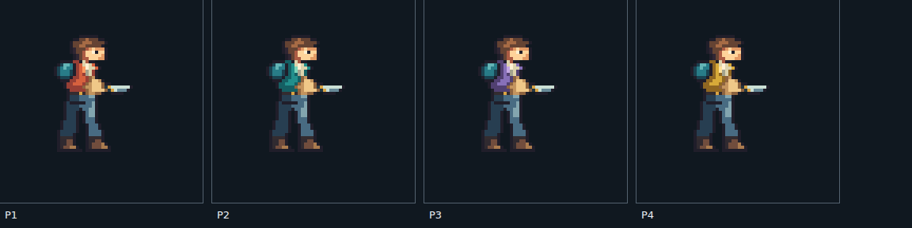

# W06 native operative and original source review

Current lifecycle update: [protected entry evidence](../W03-player-entry.md) extends shared body physics to the twelve-tick entry phase, including moving support, safe retry and first-control timing. The original 75 drawings, 300 palette frames and twenty clips remain unchanged. Current recordings use format 9; historical [death-body evidence](../W03-death-body.md) uses format 8 at `6255fe8`, and the native-action evidence below uses format 7 at `331d535`. Dedicated airborne/landing acting, vertical-aim/recovery and vehicle acting, representative enemy/tank/scenery/audio and the complete human-reviewed four-player benchmark remain open.

The native operative now includes authored horizontal head/jacket movement, knife and grenade acting, hand/grip metadata and complete body drawings for grounded death and reentry. Human style review remains pending. Vertical-aim craft, airborne death motion, vehicle acting, the representative enemy/tank/effects/scenery/audio set and the playable 45–60-second four-player benchmark are still required.

## Native source and playback

[Editable indexed source](../../../art/source/hero/operative.pixels.json) contains **75 distinct drawings**, all literal original pixel rows. Four jacket palettes produce 300 untrimmed 64×64 atlas entries with a fixed foot root at (24,48), two pixels of padding, binary alpha and normalized transparent RGB. The 20 clips cover the previous locomotion/recoil set, horizontal idle/run/landing secondary motion, standing/crouched knife and throw actions, and full-body death/reentry. Repeated recovery poses share one drawing. Some full-body source poses combine original pixel parts during source authoring; their complete literal rows are checked in and the runtime selects static frames. No concept pixels are sampled. [PNG](../../../public/assets/art/hero/operative.png), [atlas](../../../public/assets/art/hero/operative.atlas.json), [decoded-pixel/frame audit](native-frames.json).

`pnpm art:export` rebuilds the atlas, runtime manifest, source provenance and reports. `pnpm art:validate` requires byte-exact exports. The compiler checks palette/alpha rules, canvas bounds, clip channels, hand/grip contacts with actual pixels, boot contacts and sidearm release muzzles. Every firearm drawing declares a grip beside both glove and weapon pixels, and every knife/throw exposure declares a hand. The exporter also verifies release/active sockets and action/life durations against simulation content. These contracts establish consistency; they cannot approve anatomy or acting.

Open `/art-review.html#native` in `pnpm dev:lab` for 1×/2×/4× review, four palettes, individual drawings, clips, mirrored previews, backgrounds, stepped ticks and normal/quarter-speed playback. The full-body selector hides both normal layers. Continuous loops repeat without a pause; one-shot previews hold for four extra review ticks. Pink marks the root, green the authored run contact and cyan a hand/grip. In `/combat-lab.html`, enable “Native operative candidate” to play the candidate against authoritative combat state. The ordinary v2 product continues using its existing assets. Its build copies the registered candidate atlas but excludes inspector pages and editable source copies.

## Action ownership and timing

| Sequence                                   | Drawings and ticks                                                    | Gameplay relationship                                                                                                   |
| ------------------------------------------ | --------------------------------------------------------------------- | ----------------------------------------------------------------------------------------------------------------------- |
| Run                                        | Eight two-tick exposures                                              | Accepted-tick motion phase continues through shooting, knife attacks and throws.                                        |
| Horizontal secondary motion                | Four idle drawings, two additional run drawings, two landing drawings | Head/jacket/pack changes are authored pixels; fire retains priority and its release socket.                             |
| Start, stop, reverse and crouch enter/exit | Two ticks each                                                        | Cosmetic transitions follow accepted movement without delaying it.                                                      |
| Landing                                    | Four ticks                                                            | Compression/rise now have a coordinated horizontal upper pose; a new jump/fire remains immediate.                       |
| Sidearm                                    | Four ticks: base, kick, settle, base                                  | The release drawing matches the authoritative muzzle and later recoil emits no shot.                                    |
| Grenade                                    | Six drawings over 20 ticks; standing and crouched sets                | Release at age 4 matches hand (10,-24), or (10,-12) when crouched. Airborne throws retain the accepted jump/fall pose.  |
| Knife                                      | Six drawings over 18 ticks; standing and crouched sets                | The age 5–8 active window matches hand (10,-20), or (10,-12) when crouched. Recovery shares the neutral action drawing. |
| Grounded death                             | Eight full-body drawings over 30 ticks                                | `lifeStartTick` selects the sequence and suppresses both normal layers and their sockets.                               |
| Reentry                                    | Four full-body drawings over 12 ticks                                 | The authoritative life phase owns control eligibility. Jump/fire resumes on the first alive tick.                       |

Grenade and melee selection follows the accepted action definition, including posture changes during an action. Death/reentry overrides layered acting. The renderer neither changes inventory nor authorizes damage, releases, movement or respawn. Full-body support does not add a hurt state: classic rules currently kill on one hit. Vehicle actions and unsupported firearm families retain engineering presentation. The linked airborne-death increment supplies authoritative corpse motion and removal. Dedicated airborne/landing craft and accessible-rule hurt response still need review; the original grounded-death captures below do not cover them.

The existing run contacts retreat six pixels between two-tick exposures, matching three pixels of controller travel per tick. Each planted foot has a constant world contact at successive exposure boundaries on the benchmark floor. A held drawing still permits up to three pixels of contact movement within its exposure. This is discrete frame authoring, with no subframe foot locking.

The inspector advances its cosmetic locomotion clock once per accepted world tick and reconstructs it during recording replay through isolated world copies. Action and life age come directly from accepted state. Stale/skipped/repeated presentation ticks are rejected. Production prediction, remote interpolation and baseline recovery still need to integrate the native presentation pipeline.

## Validation of the native action revision

At `331d535`, `CHECKPOINT_DISABLE=1 pnpm check` passed **595 tests across 60 files**, including 23 native cases. The pixel test compares each complete decoded canvas against the indexed source, covering authored pixels and transparent space without per-pixel assertion overhead. Tests reject detached hands/grips, validate contacts and sockets, exercise throws during running/jumping/crouching, check all four knife-active ticks, and prove full-body death/reentry priority and immediate return of control. Asset/content checks, TypeScript targets, client/Worker dry run and CDK Terrain synthesis pass. [Check log](native-actions/check.log.gz).

Chromium verifies the actual facing/root pixels, all run frames and clip exposures, real grenade release positions, knife-active drawings, and grounded death/reentry pixels. Ten UI export/import recordings restore exact world and presentation state, including an active knife, death pose and the first jump/fire after reentry. Existing combat and concept-review browser regressions pass. [Browser report](native-actions/browser.json), [browser log](native-actions/browser.log.gz), [death recording](native-actions/death-recording.json), [active knife recording](native-actions/knife-stand-recording.json), [source/artifact identities](native-actions/artifacts.json).

[Normal action capture](native-actions/actions-normal.webm) and [quarter-speed action capture](native-actions/actions-quarter.webm) show actual moving grenade, contextual knife and enemy-caused death/reentry, with explicit scenario resets between segments. The [normal run/fire capture](native-actions/run-fire-normal.webm) and [quarter-speed run/fire capture](native-actions/run-fire-quarter.webm) remain available. Videos use 768×432 at Playwright's 25 fps capture cadence, distinct from the 60 Hz simulation. They have no audio or networking and do not constitute the complete benchmark or a human controller-feel test.

Native/scaled stills and sampled video frames were inspected. The knife now has a tapered highlighted blade and the throw/knife sequences change the head pose with the acting. [Crouched knife](native-actions/upper.melee.crouch-upper-melee-strike-crouch.png), [throw windup](native-actions/upper.grenade-upper-grenade-cock.png), [crouched release](native-actions/upper.grenade.crouch-upper-grenade-release-crouch.png), [grounded death](native-actions/body.death-body-death-still.png), [reentry](native-actions/body.reentry-body-reentry-rise.png). Shoulder/grip anatomy and recovery transitions still need craft refinement, especially vertical aiming and full-body vehicle use. No human style approval has been granted.

Earlier [native source/playback](https://github.com/garysassano/cdktn-cloudflare-edgefall/blob/4e8e37309771ba1c4788cab762f9b96d93eb5918/docs/redesign-evidence/style-v2/README.md) and [locomotion/recoil evidence](https://github.com/garysassano/cdktn-cloudflare-edgefall/blob/651986eff803a61d79da5ec7b211ac50b6b5e9d7/docs/redesign-evidence/style-v2/README.md) remain pinned to their source revisions. Their retained artifact hashes describe those revisions, not the current source.

## Inspect and reproduce

Run `pnpm dev:lab` and open `http://localhost:8787/art-review.html`. Select a concept study, compare black/white/gray/cyan/magenta backgrounds, inspect source pixels, and show the requested cell boundaries. The requested-logical-size option is explicitly a resampled concept preview; it neither writes nor approves a native atlas. The page loads original PNG bytes and links their exact prompts. An ordinary client build removes the page and source copies.

`pnpm art:validate` checks source/prompt hashes, provenance, bounded PNG decoding and the checked-in [source review](source-review.json). `pnpm art:review` regenerates that report after inspecting a deliberate source or policy change. `pnpm test:art:review` builds the explicit local review page and verifies it in Chromium. Set `EDGEFALL_CHROMIUM_PATH` when Chromium is provided outside Playwright's default installation.

The original lossless PNGs and prompts are in [art/source/hero](../../../art/source/hero), with the [source index](../../../art/source/provenance.json). They were generated with OpenAI's built-in image tool, without third-party reference images. The second operation used only the first project image as its edit target. The source files are retained unchanged, including failed output. No final gameplay frame is exported from them.

## Measured defects and craft review

| Study                                                                       | Decoded result                                                                                                                                                         | Required revision                                                                                                                                                                     |
| --------------------------------------------------------------------------- | ---------------------------------------------------------------------------------------------------------------------------------------------------------------------- | ------------------------------------------------------------------------------------------------------------------------------------------------------------------------------------- |
| [Original eight-pose study](../../../art/source/hero/key-pose-study-01.png) | 1774×887; 1,164,103 transparent pixels, 408,498 partial-alpha pixels and only 937 fully opaque pixels. The requested source was 1024×512 with a uniform 4× pixel grid. | Redraw at the intended native scale with clean binary body alpha, stable roots and clearly complementary run contacts. The generated run poses are too similar to establish a stride. |
| [Attempted run-pose edit](../../../art/source/hero/key-pose-study-02.png)   | 1774×887 RGB; all 1,573,538 pixels are opaque. The apparent checkerboard is painted into the source.                                                                   | Rejected as a sprite source. Retained to expose the failed transparency and changed sheet rather than silently repairing or shipping it.                                              |

The character study explores an exposed face, short orange field jacket, teal backpack, blue trousers and broad gloves/boots. These are proposed design choices, with human review pending. The fixed 384×216 gameplay viewport and proposed 34–40-pixel standing height remain the benchmark targets. Resizing an over-detailed montage in a browser does not establish one-source-pixel-per-logical-pixel art or temporal consistency.

The decoder inspects actual RGBA samples: transparency, opacity, partial alpha, hidden RGB and exact repeated blocks at the declared pixel scale. A PNG header declaring alpha is insufficient. Color-count reporting is capped and diagnostic; it is not a universal artistic palette limit. This is an import assessment, not a production exporter or an approval workflow. Source integrity may pass for a rejected concept, and machine pixel checks cannot grant human art acceptance. The decoder uses [sharp's documented pixel/metadata APIs](https://sharp.pixelplumbing.com/api-input/), with sharp 0.35.4 pinned as a development dependency after checking its current release and Node compatibility.

## Earlier concept foundation validation

The original concept foundation at `1445125` passed 572 tests across 59 files, including seven art-import cases for exact grids, partial/opaque alpha, hidden colors, corrupt/oversized input, provenance drift and separation of pixel validity from human approval. Existing asset/content checks, all TypeScript targets, the client/Worker dry run and CDK Terrain synthesis passed. [Historical check log](check.log.gz).

Chromium 151.0.7922.34 verifies both studies, all five backgrounds, source dimensions, rejection messages, requested-size previews, grid controls and exact-prompt links, with no page exceptions. [Browser report](browser.json), [browser log](browser.log.gz), [first source against cyan](hero-study-cyan.png), [opaque edit at requested logical size](rejected-edit-logical.png). The screenshots were inspected. [Production-isolation proof](production-isolation.json) confirms that a normal build excludes the review page and source images, while the runtime asset manifest, Worker entry and Wrangler configuration remain unchanged. [Source/artifact identity](artifacts.json).

## Next production work

Refine vertical-aim anatomy, action recovery and airborne death behavior; author vehicle transfer acting alongside the tank, then add the representative rifleman, shield enemy, tank and interaction effects, destructible, boss target, layered scenery and authored sounds to the same playable specimen. Capture the complete normal/quarter-speed, clean/debug, audio comparison and four-player footage before requesting the full W06 human style review.

The [integrated combat/tank audit](../W05-acceptance-audit.md) supplies the engineering scenes. Production v3, the retained host-clock and impairment findings, deployed telemetry/timing, full W07/W08 behavior, authored campaign and later quality gates remain open.
